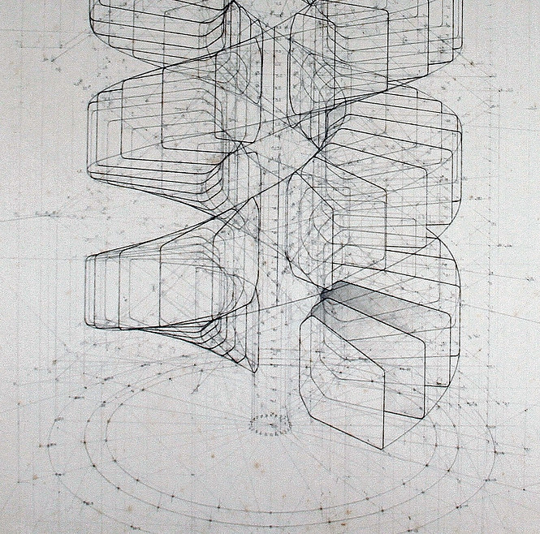

.. _autocad-tut01:

###########################
  AutoCAD : Tutoriel 01
###########################

Structure du dossier **docs**
===================================

Il s'agit du dossier contenant les fichiers source au format ``.rst`` permettant soit de produire une *sortie* ``.html``, soit une sortie``.pdf``.

Un fois placé dans le répertoire ``docs`` la commande suivante ``tree /f`` donne le résultat suivant (la commande ``tree`` seule n'aurait indiqué que les répertoires):

.. update the command ``tree /f`` in the top "docs" directory or guetting the last folders/files listing. NOTA : because of encodings pb (here in Win10), I've simply copied the output of the commande in a fresh "utf-8" file :file:`tree.txt` in Notepad++

.. literalinclude:: ../tree.txt

.. todo:: à corriger

Odoo celebrates freedom. Freedom for the designer to go further and
freedom for the user to customize everything according to their needs :term:`Manifold`.

Ready to create your own theme? Great. Here are some things you should know before you begin. This tutorial is a guide to creating an Odoo theme.

..   .. image:: autocad-tut01/img/notebook_vector.png

.. list-table::

   * - .. figure:: ../images/grange.jpg

         Grange & chevaux

     - .. figure:: ../images/hut.jpg

         A frame house

An introduction for web designers
======================================

If you are a web designer using Odoo for the first time, you are in the right place.
This introduction will outline the basics of Odoo theme creation.

.. note::

   Odoo’s team has created a framework that’s powerful and easy to use. There’s no need to know special syntaxes to use this set of tools.

Videos
--------

.. Videos from YouTube and Vimeo can be embedded using::
   .. youtube:: ID or .. vimeo:: ID
   - The ID for ``https://www.youtube.com/watch?v=Ge2Kwy5EGE0`` is ``Ge2Kwy5EGE0``
   - The ID for ``https://vimeo.com/15837189`` is ``15837189``

.. only:: builder_html and (not singlehtml)

   .. list-table:: Videos

      * - ..  youtube:: Ge2Kwy5EGE0

          Youtube video

        - .. vimeo:: 199615452

          Vimeo video

.. seealso::

   - `Python <https://www.python.org>`__ and its `documentation <https://docs.python.org/>`__.
   - `functions.wolfram.com <http://functions.wolfram.com/>`__.

Minimizing images
--------------------

Optimize image compression where possible. For PNG files, use OptiPNG and AdvanceCOMP’s advpng:

.. code-block:: bash

   $ cd docs/
   $ optipng -o7 -zm1-9 -i0 -strip all `find . -type f -not -path "./_build/*" -name "*.png"`
   $ advpng -z4 `find . -type f -not -path "./_build/*" -name "*.png"`

This is based on OptiPNG version 0.7.5. Older versions may complain about the --strip all option being lossy.

Allô ?
-----------

.. figure:: ../images/windows-logo.png
  :width: 40px
  :figwidth: 40px
  :align: right

.. tip::

  Windows "standard" (non-developpers) users are invited to download the BlenderVR Install Excecutable for Windows 7 *(though you are still advised to read through the following installation and how to use guides)*.

Driver Variables
----------------

.. list-table::

   * - .. figure:: ../images/17_EXT-_Access_Terrass.jpg
         :width: 600

         Transform Channel Setup.

     - .. figure:: ../images/2619.jpg
         :width: 600

         Distance Setup.

Workflow
-------------

Transform Driver
....................

This example shows you how setup a transform driver.
First make sure you are in the Front Ortho view. :kbd:`Numpad5`, :kbd:`Numpad1`.

#. In object mode, select then duplicate the default Cube. :kbd:`Shift-D`. Move "Cube.001" to a new location.
#. With "Cube.001" selected, add a single driver to the *Rotation Y* property.
#. Open the *Graph Editor*, set the Mode to *Drivers*.
#. *Show Only Selected* is useful disabled for drivers, marked green in the picture.
#. In the channels region, select the *Y Euler Rotation* property.
#. Press :kbd:`N` to open the properties region, scroll down to Drivers panel.
#. Change the *Type* to *Averaged Value*, this will return the averaged value of the driver variables.
#. Modify the driver variable settings:

   - Type -- Transform Channel
   - Ob/Bone -- Cube
   - Transform Type -- X Location
   - Transform Space -- World Space

   Animation

When finished, "Cube.001" should rotate on the Y axis when moving "Cube" left to right.

Drivers And Multiple Relative Shape Keys
..........................................

The following screenshots illustrate combining shape keys, bones, and
drivers to make multiple chained relative shape keys sharing a single
root. While it lacks the convenience of the single Evaluation Time of
an absolute shape key, it allows you to have more complex
relationships between your shape keys.

.. list-table:: euh y'en pa 1 pe bocou la ?

   * - .. figure:: ../images/animation_driver_workflow_for-multiple-shape-keys-key1.png

          Key1 must handle conflicting values from the two bones.

     - .. figure:: ../images/animation_driver_workflow_for-multiple-shape-keys-key2a.png

          Key2A has different generator coefficients so it is activated in a different range of the bone's position.

   * - .. figure:: ../images/animation_driver_workflow_for-multiple-shape-keys-key2b.png

          Key2B is the same as Key2A, but is controlled by the second bone.

     - .. figure:: ../images/animation_driver_workflow_for-multiple-shape-keys-retracted.png

          When both bones are low, Key2B and Key2A are deactivated and Key1 is at low influence.

   * - .. figure:: ../images/animation_driver_workflow_for-multiple-shape-keys-extended.png

          et quoi dire de plus?

     - ..

The Basis shape key has the stacks fully retracted. Key1 has the base fully extended.
Key2A has the left stack fully extended. Key2B has the right stack fully extended.
Key2A and Key2B are both relative to Key1 (as you can see in the field
in the bottom right of the Shape Keys panel.

The value of Key1 is bound to the position of bones by a driver with
two variables. Each variable uses the world Z coordinate of a bone
and uses the maximum value to determine how much the base should be
extended. The generator polynomial is crafted such that the top of
the dominant stack should line up with the bone for that stack.

The value of Key2A is bound to the position of "Bone.L".
Its generator parameters are crafted such that when Key1's value reaches 1,
the value of Key2A starts increasing beyond zero. In this way,
the top of the left stack will move with bone.L (mostly).

The value of Key2B is bound to the position of "Bone.R". Its generator
parameters are similar to Key2A so that the top of the right stack
will move with bone.R (mostly).

Since it is quite easy for bone.L and bone.R to be in positions that
indicate conflicting values for Key1 there will be times when the
bones do not line up with the tops of their respective stacks. If the
driver for Key1 was to use Average or Minimum instead of Maximum to
determine the value of the shape key then "conflicts" between bone.L
and bone.R would be resolved differently. You will choose according to
the needs of your animation.

.. vimeo:: 173408647

From common CMS to Odoo
............................

.. note::

   If you always think and work in the same way, you’ll probably get the same results. If you want something completely new,  then try something different.

.. _autocad-tut01_mod-Jan20:

Composition of a module
-----------------------

An Odoo module can contain a number of elements:

Business objects
    declared as Python classes, these resources are automatically persisted
    by Odoo based on their configuration

Data files
    XML or CSV files declaring metadata (views or workflows), configuration
    data (modules parameterization), demonstration data and more

Web controllers
    Handle requests from web browsers

Static web data
    Images, CSS or javascript files used by the web interface or website

.. admonition:: Reference
   :class: refbox

   | Mode:     Object Mode
   | Hotkey:   :kbd:`Ctrl-Numpad0`

Render Border
=============

.. admonition:: Reference
   :class: refbox

   | Mode:     All modes
   | Menu:     :menuselection:`View --> Render Border`
   | Hotkey:   :kbd:`Ctrl-B`

.. figure:: ../images/60897883c74ddba9f88350b924cf7b5d.jpg
   :width: 500
   :align: right

Render Border toggle.

While in camera view, you can define a subregion to render by drawing out a rectangle within the camera's frame.
Your renders will now be limited to the part of scene visible within the render border.
This can be very useful for reducing render times for quick previews on an area of interest.

The border can be disabled by disabling the *Border* option in the *Dimensions* panel
in the *Render* tab or by activating the option again.

Ea pariatur duis fugiat ad eu nisi nostrud elit. Sint id cupidatat ipsum veniam non magna dolor deserunt magna incididunt id mollit esse. Exercitation duis tempor proident tempor commodo Lorem commodo anim laborum cupidatat pariatur dolore esse labore aliquip. Nisi occaecat aliquip dolor excepteur officia id exercitation magna consectetur irure aliqua dolore cillum commodo aliquip. Non dolor est sunt consectetur cillum enim sint.

.. note::

   When Render Border is activated, :doc:`Motion Blur <../guides/autocad-guide01>`
   will become available to view in the 3D View.

Reprehenderit eiusmod magna adipisicing veniam anim occaecat magna tempor. Enim elit voluptate magna exercitation amet ad commodo anim consectetur. Ipsum mollit voluptate ex laborum qui sunt cillum aliquip laborum in quis sint ut et. Aliqua ea sunt cupidatat excepteur quis nulla sunt enim sunt adipisicing aliquip nulla id dolor ut eu ex. Eiusmod incididunt laborum dolor eiusmod do proident excepteur eu elit dolore reprehenderit tempor.

Deserunt culpa ex eiusmod exercitation esse ea et elit nulla cillum eu occaecat velit anim aliqua. Minim nisi cupidatat laboris ipsum qui ullamco culpa excepteur duis est sit exercitation sunt ipsum. Reprehenderit labore dolore irure fugiat amet aliquip occaecat aliquip culpa ullamco cupidatat. Consectetur minim dolor cupidatat ipsum aute pariatur excepteur ullamco cupidatat occaecat cillum amet id Lorem velit. Aliqua ex pariatur esse ea nostrud veniam minim in nostrud. Laboris laboris consectetur tempor mollit duis exercitation ullamco cupidatat ad enim laborum Lorem mollit pariatur ullamco ea ut.

Id et eiusmod aliqua non adipisicing ea velit aute eiusmod non. Magna Lorem veniam sunt nostrud mollit et veniam ad eu ullamco ut id ex eiusmod. Esse anim ipsum anim consectetur nisi ea consectetur ad sint nulla.

.. .. container:: lead

.. ..    clear

..
   .. note::

   When Render Border is activated, :doc:`Motion Blur <../guides/autocad-guide01>`
   will become available to view in the 3D View.

.. list-table:: Render border and associated render.
   :widths: 60 40

   * - .. figure:: ../images/Puquios-Nazca-Peru-Getty-Images_CLAIMA20160421_0299_17.jpg

         Anim 1

     - .. figure:: ../images/c1aab2e38fa5519f5661c12f1e0887cf.jpg

         Anim 2

Undo
-----------

.. admonition:: Reference
   :class: refbox

   | Mode:     All Modes
   | Panel:    :menuselection:`Tool Shelf --> Tools --> History --> Undo`
   | Menu:     :menuselection:`Object/Object types --> Undo`
   | Hotkey:   :kbd:`Ctrl-Z`

If you want to undo your last action, just press :kbd:`Ctrl-Z`.

.. seealso::

   this section on undo to change defaults.

.. _bpy.ops.ed.redo:

Redo
-------------

.. admonition:: Reference
   :class: refbox

   | Mode:     All Modes
   | Panel:    :menuselection:`Tool Shelf --> Tools --> History --> Redo`
   | Menu:     :menuselection:`Object/Object types --> Redo`
   | Hotkey:   :kbd:`Ctrl-Shift-Z`

To roll back the Undo action, press :kbd:`Ctrl-Shift-Z`.

Undo History
----------------

.. admonition:: Reference
   :class: refbox

   | Mode:     All Modes
   | Panel:    :menuselection:`Tool Shelf --> Tools --> History --> Undo History`
   | Menu:     :menuselection:`Object/Object types --> Undo History`
   | Hotkey:   :kbd:`Ctrl-Alt-Z`

   The Undo History Menu.

There is also an Undo History of the last actions taken, recorded by Blender.
You can access the history pop-up with :kbd:`Ctrl-Alt-Z`.

First positions correspond to most recent actions.
A small icon of an eye next to one of the entries indicates the current status.
Rolling back actions using the *Undo History* feature will take you back to the
action you choose. Much like how you can alternate between going backward in
time with *Undo* and then forward with *Redo*,
you can hop around on the Undo timeline as much as you want as long as you do not make a new change.
Once you do make a new change, the Undo History is truncated at that point.
Selecting one of the entries in the list takes the current status to that position.

Ipsum ullamco ut enim commodo velit ea eiusmod. Consectetur est dolor amet sint eu duis pariatur ullamco voluptate eiusmod adipisicing irure ea esse ea reprehenderit. Commodo cillum dolor mollit proident magna duis deserunt tempor cillum sint. Laboris anim consectetur excepteur deserunt ut aliqua labore fugiat minim nostrud. Quis deserunt non magna nisi cillum duis exercitation ex dolor.

Ea sunt dolor minim minim sint fugiat deserunt anim. Qui eu ut veniam laborum qui cillum Lorem enim tempor veniam qui reprehenderit amet amet reprehenderit. Lorem sit nisi est laboris sunt id incididunt aliquip do cillum sint culpa reprehenderit. Aute anim aute in amet ad dolore esse enim tempor ad elit enim proident laboris velit voluptate amet.

Qui ipsum culpa sit duis ex culpa pariatur proident exercitation ad cupidatat culpa voluptate. Dolore duis do pariatur anim ipsum enim qui qui. Ex ut minim pariatur nisi veniam ex culpa ad eu ad in eu et.

Ullamco Lorem consectetur ex enim quis ad magna non in incididunt duis nostrud nulla do ea duis nisi. Aliquip aliqua dolor duis officia ad ad voluptate labore officia proident ex adipisicing cillum nulla eiusmod aliqua. Fugiat minim sunt in nisi ad incididunt esse nulla anim voluptate officia id Lorem incididunt. Consectetur incididunt in do adipisicing laboris reprehenderit laborum tempor excepteur mollit ad cupidatat et consequat.

Repeat Last
-----------------

.. admonition:: Reference
   :class: refbox

   | Mode:     All Modes
   | Panel:    :menuselection:`Tool Shelf --> Tools --> History --> Repeat: Repeat Last`
   | Hotkey:   :kbd:`Shift-R`

The Repeat Last feature will repeat your last action when you press :kbd:`Shift-R`.

In the example Images below, we duplicated a *Monkey* mesh,
and then we moved the Object a bit.
Using repeat :kbd:`Shift-R`, the *Monkey* was also duplicated and moved.

.. list-table:: Undo & Redo

   * - .. figure:: ../images/lifebuzz-d2eee5ab9cb679f82e4a833de75ae7dc-limit_2000.jpg
         :width: 200

         Kardash.

     - .. figure:: ../images/lifebuzz-9ec5cca7207d61cf1928374b5fdd7373-limit_2000.jpg
         :width: 200

         Kayne, after :kbd:`Ctrl-Alt-D` and move.

     - .. figure:: ../images/lifebuzz-02bcb92df06a65cee6510fbe0c9956eb-limit_2000.jpg
         :width: 200

         Together :kbd:`Win-Q`.

Nostrud velit eu magna sit commodo dolore ullamco id cillum esse eu culpa non anim in aliquip. Esse amet eiusmod eiusmod et tempor culpa proident sunt ipsum officia cupidatat proident exercitation. Tempor laborum culpa eiusmod minim amet sunt deserunt do ullamco magna. Proident sit enim nostrud irure in eiusmod nisi tempor laboris id aute tempor. Nulla laborum occaecat duis tempor laborum elit nisi culpa qui.

Ut duis aute nulla labore et aute reprehenderit ad duis qui ut et officia. Reprehenderit nostrud excepteur labore occaecat voluptate consequat cupidatat. Quis proident est ad id cillum deserunt labore duis elit aliqua nulla amet. Adipisicing ullamco occaecat ex laborum ipsum ea irure incididunt velit est reprehenderit aliqua duis. Fugiat eu non in laboris ut mollit voluptate nulla eu culpa labore sint aliqua do laboris.

Aute esse reprehenderit veniam ullamco culpa ex sint dolore et. Excepteur labore enim esse adipisicing Lorem amet adipisicing exercitation deserunt eiusmod sunt. Dolor in amet sint enim dolor exercitation nulla adipisicing nulla ad veniam est. Fugiat aute mollit labore ullamco commodo consequat laboris. Ex non est sint officia aliquip duis Lorem aliquip ipsum in culpa minim mollit Lorem ullamco tempor adipisicing. Esse eu elit cillum sint occaecat sint cupidatat laborum ullamco labore cupidatat. Veniam dolore occaecat ipsum anim et do ex. Incididunt mollit fugiat cillum est non aliquip Lorem non ad id cupidatat ipsum ad occaecat exercitation veniam.

Velit aliqua sunt veniam sit irure nulla anim sint. Aliqua magna tempor voluptate elit magna amet minim in esse. Anim in magna ullamco aliqua adipisicing elit aliqua mollit. Ex ad velit do tempor proident eu quis ipsum commodo.

.. _bpy.ops.ed.undo_history:

Repeat History
---------------

.. admonition:: Reference
   :class: refbox

   | Mode:     All Modes
   | Panel:    :menuselection:`Tool Shelf --> Tools --> History --> Repeat: History...`
   | Hotkey:   :kbd:`F3`

The Repeat History Menu.

The *Repeat History* feature will present you a list of the last repeated actions,
and you can choose the actions you want to repeat.
It works in the same way as the Undo History, explained above,
but the list contains only repeated actions. To access Repeat History, use :kbd:`F3`.

In nostrud elit sunt enim labore laboris aute magna tempor veniam proident. Mollit dolor adipisicing enim qui nisi est sunt. Culpa incididunt qui anim pariatur consequat fugiat magna amet non minim magna. Aute amet cillum aute ad reprehenderit reprehenderit in officia et.

Adipisicing tempor ullamco in mollit reprehenderit eiusmod incididunt culpa aliqua do occaecat sint ipsum deserunt culpa deserunt. Aute eiusmod reprehenderit ullamco veniam commodo commodo nostrud aliquip aliqua ea est quis esse mollit laborum consequat culpa. Pariatur irure nisi incididunt est esse nostrud elit est do anim do ad voluptate. Labore enim nulla reprehenderit excepteur mollit adipisicing reprehenderit sit elit in et ut. Commodo est irure incididunt commodo aliquip ut amet fugiat occaecat. Ullamco cupidatat est nisi veniam anim minim anim magna fugiat aliqua elit. Officia elit dolore occaecat magna pariatur officia duis irure in. Ex et aliqua anim aliqua exercitation veniam reprehenderit sit cillum in ex cillum aliquip amet do voluptate tempor.

Nostrud amet excepteur adipisicing amet occaecat cillum non non. Ipsum eiusmod sint qui consectetur ea occaecat sunt proident officia enim eu. Magna enim et laboris adipisicing dolor quis laborum excepteur et et aute nisi. Labore irure est sint velit veniam cupidatat aute. Enim sint do voluptate adipisicing incididunt incididunt dolor non elit laboris proident laboris. Ex dolore exercitation Lorem enim duis occaecat eiusmod nostrud non do nostrud. Dolor cillum culpa laboris ut ut labore laboris aliqua velit culpa exercitation nulla nostrud voluptate labore ea dolore.

Ea dolore tempor Lorem dolore ipsum consequat consequat ea ea. Proident dolor pariatur adipisicing nostrud adipisicing adipisicing aliquip voluptate veniam quis id ullamco proident officia consectetur quis. Enim qui exercitation duis proident irure sint reprehenderit exercitation ea aliqua irure est nostrud consequat laboris quis incididunt. Nulla enim ad eiusmod amet sint culpa magna tempor sunt Lorem nulla. Proident deserunt eu consectetur qui cupidatat adipisicing do nostrud deserunt aliquip non. Pariatur eu nisi Lorem ipsum elit irure sit nisi fugiat irure consequat in labore cupidatat incididunt adipisicing. Sint ea esse excepteur culpa qui do aliqua do ea Lorem sunt laborum. Cillum cupidatat et labore do in laborum mollit amet sit occaecat sint ipsum magna do veniam adipisicing.

.. container:: lead

   .. clear

.. note::

   Blender uses two separate Histories, one dedicated for the *Edit Mode*, and one dedicated for the *Object Mode*.

Nulla exercitation nulla duis ex sint esse laborum ipsum proident. Proident cillum commodo pariatur labore ad non sit minim elit ipsum eiusmod qui laboris cillum. Magna Lorem et et nostrud nostrud enim consequat sunt reprehenderit. Excepteur esse laboris consequat incididunt officia aliquip do elit nisi nostrud aute ut ipsum. Magna elit ipsum et id culpa sunt minim sint velit consequat nisi enim. Cupidatat mollit veniam nulla ut commodo sit ad est. Id ipsum cupidatat sit deserunt esse aliquip elit occaecat non sunt in ut labore quis nisi nisi.

Nulla excepteur Lorem ullamco est ipsum cupidatat dolor eiusmod culpa fugiat excepteur qui mollit sunt. Nisi qui occaecat proident velit deserunt reprehenderit eu anim. Aliquip cupidatat nisi proident non quis eu id exercitation amet commodo mollit magna. Exercitation officia est proident qui sunt consectetur cillum irure anim. Cupidatat laboris laboris laboris aute ad cupidatat do sunt qui et. Cupidatat excepteur tempor reprehenderit eiusmod labore in ea ea laborum cillum non pariatur minim magna ad commodo.

Id quis deserunt ex velit minim ex consequat fugiat occaecat ad minim sit anim. Laboris adipisicing excepteur dolore consequat ad dolore anim mollit dolor consequat deserunt consequat. Minim laborum fugiat deserunt est pariatur deserunt nisi minim tempor occaecat. Culpa esse proident tempor minim dolore nostrud duis magna.

Ad deserunt id aute ad commodo occaecat sunt aliquip ullamco. Ullamco consectetur sunt ea ea sit ea incididunt anim reprehenderit excepteur consectetur. Adipisicing exercitation officia est veniam ut proident et proident ex sit nostrud commodo.

.. important::

   When you quit Blender, the complete list of user actions will be lost, even if you save your file before quitting.

Pariatur consectetur qui aliquip adipisicing culpa eiusmod fugiat amet aliquip pariatur occaecat elit labore ex et duis. Nulla non ullamco labore fugiat sit culpa ex. Commodo anim sint duis anim eu proident id magna. Sunt consectetur quis nulla nisi nisi ex irure excepteur ea laboris veniam eu adipisicing dolor mollit. Cupidatat nostrud aliqua occaecat mollit id excepteur voluptate nisi sit amet pariatur consectetur minim dolore nulla. Mollit excepteur id consequat do esse ex commodo pariatur consectetur labore enim consectetur.

Cupidatat dolor nisi sint cupidatat nostrud eu ex reprehenderit nulla. Officia aliqua Lorem officia proident elit irure laboris officia pariatur reprehenderit ea anim ut. Proident consectetur eu ut pariatur consequat eiusmod aute amet elit occaecat sint in Lorem eu. Ea elit aliquip ex tempor ut excepteur sunt labore non culpa eiusmod consectetur enim eu dolore irure. Eiusmod aliqua esse ipsum minim Lorem excepteur nostrud magna aliquip ex fugiat Lorem veniam. Nostrud cillum ullamco eu irure sunt aute non labore pariatur elit nulla sint incididunt do ullamco pariatur ea. Tempor voluptate culpa aliqua magna cillum incididunt officia commodo elit anim deserunt et velit laborum. Nostrud dolor aliquip qui aliqua occaecat velit excepteur.

Fugiat laboris exercitation adipisicing ipsum commodo nisi cillum. Tempor sint incididunt mollit excepteur elit aliqua tempor enim ex consequat reprehenderit minim voluptate sunt. Velit mollit non commodo labore adipisicing culpa consequat elit ipsum. Ex tempor nostrud dolor commodo id et nostrud eiusmod dolor enim mollit exercitation ea id in voluptate proident. Enim Lorem ullamco elit culpa cillum do labore ad dolor eiusmod elit ullamco. Tempor eu ea exercitation in enim pariatur commodo. Ex id dolor laborum adipisicing aliqua ipsum reprehenderit adipisicing sit sint qui nisi dolor anim ut reprehenderit ipsum. Dolore occaecat sint exercitation id labore laboris ex reprehenderit.

Exercitation sunt ex qui proident exercitation nisi laboris culpa elit duis. Nisi sint magna mollit cupidatat Lorem est tempor. Magna officia exercitation fugiat ut ex nisi adipisicing aliqua cupidatat incididunt cupidatat tempor cupidatat ipsum. Sint minim ipsum irure qui eu officia est sit culpa aliquip quis duis. Consectetur eu consequat pariatur officia tempor adipisicing anim magna in.

.. seealso::

   Troubleshooting section on :doc:`Recovering your lost work <autocad-tut02>`

..
.. Multiple Choice with One Correct Answer
.. =======================================
..
.. Make sure the string that follows the `.. eqt::` directive is unique throughout
.. your documents. Can you spot which answer is marked as the correct one? After
.. processing, the result is:
..
.. .. eqt:: COD-integerencoding-videoeqt-eqt_11
..
..    **Question 1** What is the representation of the number -127 in 2s
..    complement with 8 bits?
..
..    A) :eqt:`I` `1000 0000`
..
..    #) :eqt:`I` `1111 1111`
..
..    #) :eqt:`C` `1000 0001`
..
..    #) :eqt:`I` None of the above
..
.. Go ahead, answer it! The question is translated to the proper HTML, the right
.. scripts inserted, and everything handled properly as specified by the
.. markup.
..
.. Check the following document for an example of a file containing **only**
.. questions of this type.

Configuring PDF rendering
=========================

If you want docs.typo3.org to generate a PDF file out of your documentation project, your
documentation project must have a file :file:`Settings.yml` (located at the root of your
:file:`Documentation/` folder). Make sure this file, inside a block for :file:`conf.py`,
at least contains the following configuration options (lines 6 to 15);
in this example taken from the TYPO3 extension "sphinx":

.. code-block:: yaml
   :linenos:
   :emphasize-lines: 6-11

   conf.py:
   copyright: 2013-2014
   project: Sphinx Python Documentation Generator and Viewer
   version: 2.1
   release: 2.1.0
   latex_documents:
   - - Index
      - sphinx.tex
      - Sphinx Python Documentation Generator and Viewer
      - Xavier Perseguers
      - manual
   latex_elements:
   papersize: a4paper
   pointsize: 10pt
   preamble: \usepackage{typo3}

Lines 7 to 11 define options for value ``latex_documents`` which determines how to group the document tree into LaTeX
source files. This is a list of tuples: ``startdocname``, ``targetname``, ``title``, ``author``, ``documentclass``, where
the items are:

startdocname
	Document name that is the "root" of the LaTeX files. All documents referenced by it in TOC trees will be included
	in the LaTeX file too.

	.. warning::
		Always use ``Index`` here.

targetname
	File name of the LaTeX file in the output directory.

	.. warning::
		Always use your extension key followed by ``.tex`` here.

title
	LaTeX document title. This is inserted as LaTeX markup, so special characters like a backslash or ampersand must be
	represented by the proper LaTeX commands if they are to be inserted literally.

author
	Author for the LaTeX document. The same LaTeX markup caveat as for *title* applies. Use ``\and`` to separate
	multiple authors, as in: ``'John \and Sarah'``.

documentclass
	Normally, one of ``manual`` or ``howto`` (provided by Sphinx).

	.. tip::
		To keep TYPO3 branding, you should always use ``manual`` here.

Lines 12 to 15 should be kept as they are. Especially the exact content of line 15 is important:
This code actually is the "trigger" for PDF rendering.

When activated, your PDF automatically gets rendered on https://docs.typo3.org under
:file:`https://docs.typo3.org/typo3cms/extensions/{extension-key}/_pdf/`. E.g.,
https://docs.typo3.org/typo3cms/extensions/sphinx/_pdf/.

(Information taken from the `documentation of the sphinx extension`__ by Xavier Perseguers.)

__ https://docs.typo3.org/typo3cms/extensions/sphinx/WritersManual/DocsTypo3Org/Index.html#pdf-rendering

Commandes GIT
================

Ex eu elit labore dolor et esse anim dolore exercitation aute elit aliqua. Officia laborum aliquip nostrud esse enim amet non eiusmod cillum ut nisi quis aute aliquip irure. Ullamco ex in do ad reprehenderit labore dolore tempor. Ea et et ipsum eu laborum sit cupidatat mollit laboris quis fugiat ut laboris. Consectetur aliqua occaecat in elit est commodo et eiusmod non pariatur.

Récupérer des fichiers supprimés en local
---------------------------------------------

Avant
........

- On est dans le repo ``edx-sphinx-theme``, à récupérer avec git par la commande suivante::

     $ git clone https://github.com/edx/edx-sphinx-theme.git

- on a modifié des fichiers ... et sutout, supprimé quelque uns ...

Pendant
........

On cherche donc à retourner à l'état original du répertoire local.

Il n'y a plus qu'à exécuter cette commande pour connaitre les fichiers supprimés en local::

   $ git ls-files --deleted

retourne:

.. code-block:: bash
   :linenos:
   :emphasize-lines: 2-3

   edx_theme/static/font/fontawesome_webfont.eot
   edx_theme/static/font/fontawesome_webfont.svg
   edx_theme/static/font/fontawesome_webfont.ttf
   edx_theme/static/font/fontawesome_webfont.woff

En exécutant la commande suivante::

   $ git checkout -- edx_theme/static/font/*

On récupère d'un coup toutes les polices que l'on avait accidentellement supprimé.

Télécharger **un seul** fichier depuis un dépôt distant Github
-----------------------------------------------------------------

- Open the file in the browser
- click on "Raw" button
- Now refresh your browser, copy the url
- and do a wget or curl on it.

wget example::

   wget https://github.abc.abc.com/raw/abc/folder1/master/folder2/myfile.py?token=DDDDnkl92Kw8829jhXXoxBaVJIYW-h7zks5Vy9I-wA%3D%3D -O myfile.py

   wget https://raw.githubusercontent.com/TYPO3-Documentation/TYPO3CMS-Book-ExtbaseFluid/Documentation/Targets.rst

Curl example::

   curl https://example.com/raw.txt > savedFile.txt

Module structure
----------------

Each module is a directory within a *module directory*. Module directories
are specified

.. tip::

    most command-line options can also be set using

Incididunt deserunt nisi irure duis labore occaecat culpa. Qui veniam consequat nostrud qui quis pariatur pariatur anim mollit adipisicing aliquip sint ad nulla. Qui sunt officia enim pariatur nostrud qui enim quis reprehenderit pariatur. Irure in officia in minim et esse culpa quis aliquip elit elit occaecat veniam dolore proident aliquip. Mollit commodo deserunt tempor dolor nulla quis ex. Pariatur cillum sint id amet id magna sint officia aliqua cupidatat aliquip ad mollit incididunt excepteur. Sint officia consequat pariatur commodo dolor enim adipisicing sunt sit. Ex ut eiusmod mollit irure eiusmod ut mollit incididunt.

.. only:: builder_html

       See :download:`ce fichier de configuration <autocad-tut01/fichiers/gabarit_acad2010_teb+imprimante_pdf.zip>`.
       ou carrément alors :
       :download:`ici <./autocad-tut01/fichiers/gabarit_acad2010_teb+imprimante_pdf.zip>`
       quoique
       La documentation est aussi disponible sous forme de document :download:`. <autocad-tut01/fichiers/gabarit_acad2010_teb+imprimante_pdf.zip>`

The :guilabel:`Lesson selector` will show up. quoique :menuselection:`Plugins --> Lessons --> Start Lesson` marche aussi

Sint labore quis est elit quis adipisicing amet adipisicing incididunt incididunt elit ipsum ullamco. Nulla elit minim ad nostrud quis amet ex. Adipisicing magna ex qui ullamco pariatur sit et minim tempor labore eu.

Minim voluptate amet culpa anim qui elit aliquip et ut do nostrud. Pariatur sint ipsum occaecat aute exercitation anim pariatur ex mollit fugiat aute quis sint ullamco culpa. Pariatur reprehenderit nulla fugiat sit adipisicing nostrud anim. Consequat eiusmod mollit deserunt officia duis nulla labore ad laborum. Fugiat do nulla eu labore qui occaecat laborum dolore sint Lorem. Cupidatat mollit eiusmod minim amet excepteur minim cillum nisi enim aliquip exercitation incididunt velit aliquip. Lorem ad velit pariatur laboris fugiat tempor nostrud ex.

Sit ut Lorem deserunt sint duis sunt ullamco velit irure amet veniam. Consectetur incididunt laborum excepteur voluptate fugiat nulla anim ullamco non laboris est pariatur elit sint. Nostrud nulla qui ea ex consequat nostrud excepteur aute proident. Ea non esse anim nulla est aliqua reprehenderit dolor pariatur culpa quis Lorem do aute nostrud culpa consectetur. Ad excepteur id nisi anim est ad ullamco. Consequat eiusmod do ipsum excepteur mollit quis laborum velit quis magna nostrud aute aliquip veniam eiusmod. Enim in eu deserunt ea ullamco aliqua tempor magna ipsum qui elit anim anim consequat.

:menuselection:`Start --> Programs` and :kbd:`C-x C-f` Voluptate :guilabel:`&Cancel` duis non reprehenderit officia sunt aliqua ad. Ipsum et ullamco cupidatat ullamco incididunt aliqua qui nisi ex veniam et. Dolore mollit occaecat reprehenderit ad qui quis qui commodo eu. Amet eu officia ut Lorem culpa sit tempor ipsum minim cupidatat reprehenderit eu anim sint amet sint Lorem.

.. _my-figure:

   Belle figure 01 caption

a reference to :ref:`my-figure` would insert a reference to the figure with link text “Belle figure 01 caption”.

Usage
------
Incididunt ex eu do tempor veniam eiusmod aute reprehenderit ad culpa exercitation. Non sint minim quis labore minim eiusmod minim aute ex deserunt aute. Cupidatat minim ullamco commodo ex excepteur nulla aliquip exercitation dolor Lorem commodo. Nulla qui dolore duis exercitation minim laboris et cupidatat tempor Lorem proident occaecat. Sit quis velit tempor pariatur non officia reprehenderit adipisicing ea est reprehenderit sunt in est nostrud do officia. Labore tempor exercitation do et qui incididunt esse velit. Pariatur incididunt nulla id deserunt sint culpa irure sunt nulla elit laborum enim. Ullamco labore deserunt consequat nulla aliqua voluptate et id quis ex id minim ipsum.

Id incididunt adipisicing sunt officia occaecat qui sint exercitation consectetur minim. Voluptate officia reprehenderit fugiat cillum ea duis aliqua id nisi occaecat. Voluptate eiusmod commodo occaecat aute enim magna voluptate dolore labore velit. Excepteur tempor proident enim eiusmod aliquip tempor sint nostrud eiusmod deserunt ipsum nulla exercitation elit commodo nostrud. Reprehenderit sunt et ea consequat culpa proident eiusmod duis pariatur ut ad exercitation.

Mollit ea tempor veniam Lorem duis occaecat dolore laborum. Enim tempor quis voluptate laboris esse aliqua quis nisi cupidatat incididunt nostrud non. Eu officia Lorem enim in esse Lorem dolor voluptate dolor deserunt in occaecat. Occaecat eu irure fugiat magna sint dolor nulla nisi dolor quis voluptate Lorem. Tempor voluptate consectetur dolor aliqua irure mollit commodo dolore laborum velit occaecat consequat elit enim incididunt in.

Sunt consequat consequat velit ipsum dolore incididunt do anim tempor duis culpa duis magna. Esse deserunt do sunt irure culpa aliquip minim sint laboris. Id ex adipisicing commodo non eiusmod in laboris commodo dolore consequat sit nostrud dolore consequat culpa.

Start lessons
................

#. To open a lesson, go to :menuselection:`Plugins --> Lessons --> Start Lesson`. The :guilabel:`Lesson selector` will show up.

   .. figure:: autocad-tut01/img/objects.png

#. If Boundless Connect plugin was configured to use a local directory-based repository instead of the remote one, then you don't need to enter any credentials, and you can go directly to :menuselection:`Plugins --> Manage and install plugins`.

#. The lessons are organized in groups. If necessary, click the cross next to the group's name to expand its lessons list.

#. The following buttons compose the button bar:

* **Move to next step** - To go to the next lesson's step.
* **Run step** - Helps performing the steps instructions (not always available).
* **Restart lesson** - Resets the project and cleans all the lesson's progress made so far.

Even few steps below, a reference to :ref:`my-figure` would insert a reference to the figure with link text “Belle figure 01 caption”.

Remotes
............

Remotes are "remote repositories" which can be fetched from and pushed
to. Remotes can be listed with ``git remote`` and a local
repository can have any number of remotes. The setup script creates 2 remotes:

``odoo``
    the official repository and main branches, roughly corresponds to the old
    "mainline" branches in bazaar. You should never need to push to it, and by
    default your local copy is configured to forbid it.
``odoo-dev``
    a grab-bag of development branches, you can push your work to it so other
    coworkers can work with you.

Branches
.............

The working copy and each remote contain multiple branches. Local branches can
be listed by ``git branch``, remote branches can be listed with ``git branch
-r``. Both types can be listed with ``git branch -a``.

Work is only possible on local branches, even though it's possible to check
out a remote branch work on it will be lost.

Staging
..............

``bzr commit`` takes all alterations to the working copy and creates a commit
from them. Git has an intermediate step called "staging". ``git commit`` will
create a commit from what has been staged, not from the working copy. Staging is done with ``git add``. A commit with nothing
staged is a null operation.

.. warning::

    It's possible for a single file to have changes in both the index and
    working copy: if a file is altered, staged and altered again, the second
    set of change has to be staged separately

SHA1
.........

Git has no sequential identifier, each commit is uniquely identified by a SHA
(40 hexadecimal characters) roughly corresponding to a bazaar
revision-id. Providing the full sha is rarely necessary, any unique leading
substring is sufficient, e.g. ``dae86e`` will probably stand in for
``dae86e1950b1277e545cee180551750029cfe735``.

Basic development workflow
--------------------------

* update your remotes with ``git fetch --all``
* create your development branch with ``git checkout -b <branch_name>
  <source_branch>``. For instance if you wanted to add support for full-text
  search in master you could use ``git checkout -b master-fts-xxx odoo/master``
* do your changes, stage them with ``git add`` and commit them with ``git
  commit``
* if your branch is long-lived, you may want to update it to its parent

  - update the remotes with ``git fetch --all``
  - merge the remote branch into the local one with ``git merge --no-ff
    odoo/master``

* to push the branch to the development repository, use ``git push -u dev
  <branchname>``, this will automatically create a branch called
  ``<branchname>`` on dev. Next time around you do not have to use ``-u``
* once the feature is done, create a pull request

Minimizing images
------------------

Optimize image compression where possible. For PNG files, use OptiPNG and AdvanceCOMP’s advpng::

  $ cd docs/
  $ optipng -o7 -zm1-9 -i0 -strip all `find . -type f -not -path "./_build/*" -name "*.png"`
  $ advpng -z4 `find . -type f -not -path "./_build/*" -name "*.png"`

Using GitHub pages
---------------------

This is the option I will describe in some detail, since it may be a
little involved and also I haven't tried this yet, myself.

First, create a new *empty* repository with no README on `GitHub
<http://www.github.com>`_. Let's call it `site`. Now, clone the
repository::

	git clone https://github.com/amitsaha/site.git
		Cloning into 'site'...
		warning: You appear to have cloned an empty repository.

Create a ``gh-pages`` branch in your repository and switch to it::

  git checkout -b gh-pages

Now, copy *all* the files and directories in ``html`` directory to this
directory::

  git add -a
  git commit -m "first commit of static HTML"

Now, push the ``gh-pages`` branch to the remote repository::

  git push origin gh-pages

Once that is complete, you can now go to the URL:
``http://github-user-name.github.com/site`` to see your pages. See
`this <http://amitsaha.github.com/site/demo>`_ page as an example.

You can of course now have multiple directories in the ``site``
repository and then you can host a different set of static pages.

For example, "demo" dir

Now, let us say that you want to store your HTML files in a separate
directory, called ``demo``::

  mkdir demo

Now, copy *all* the files and directories in ``html`` directory to this
directory.

Add the ``demo`` directory to Git and commit the changes::

  git add demo
  git commit -m "Created "demo" dir and first commit of static HTML in demo"

Now, push the ``gh-pages`` branch to the remote repository::

  git push origin gh-pages

Flutuat nec mergitur 1
------------------------

Anim laboris non laborum non velit sunt ipsum sit duis. Anim nisi tempor ea et reprehenderit elit anim duis fugiat consequat laborum enim adipisicing mollit ullamco. Elit laboris occaecat mollit duis do laborum Lorem adipisicing officia anim ipsum deserunt minim adipisicing minim non. Anim officia proident dolor quis sint dolore esse. Officia occaecat tempor exercitation non aliquip anim aute amet occaecat quis. Adipisicing adipisicing dolore et elit et ipsum nostrud ipsum.

Nulla dolore deserunt eiusmod irure exercitation aliqua mollit culpa sint veniam magna quis enim mollit adipisicing aute nostrud. Aliqua voluptate quis cillum aliqua irure dolor cupidatat sint magna. Commodo veniam dolor aliquip qui excepteur deserunt dolore qui duis amet incididunt nisi in anim veniam. Amet ullamco mollit aliquip tempor et aute ullamco ut dolore. Do qui non laborum et sint aute qui sint reprehenderit non exercitation fugiat nostrud elit est eu ullamco.

Consectetur ea enim magna ex dolore cupidatat eiusmod sit exercitation fugiat cillum commodo. Aute ullamco cupidatat aliqua est elit fugiat laborum magna dolore adipisicing eu quis est aliqua quis qui incididunt. Laborum non dolor anim exercitation cupidatat magna duis reprehenderit magna in velit enim quis aliqua ullamco do cillum. Laboris culpa deserunt aliquip cillum est ex id id consequat.

Et magna tempor labore ad pariatur nisi laboris qui veniam Lorem esse. Excepteur ipsum non duis anim cupidatat nisi do ut ea proident. Veniam sunt in proident dolore enim officia proident. Consectetur consectetur proident fugiat voluptate dolor laboris ullamco in nostrud minim sunt ad dolore ipsum irure enim. Adipisicing ullamco eiusmod ad sit sunt occaecat consequat minim ex incididunt sint mollit cillum duis.

Anim laboris non laborum non velit sunt ipsum sit duis. Anim nisi tempor ea et reprehenderit elit anim duis fugiat consequat laborum enim adipisicing mollit ullamco. Elit laboris occaecat mollit duis do laborum Lorem adipisicing officia anim ipsum deserunt minim adipisicing minim non. Anim officia proident dolor quis sint dolore esse. Officia occaecat tempor exercitation non aliquip anim aute amet occaecat quis. Adipisicing adipisicing dolore et elit et ipsum nostrud ipsum.

Nulla dolore deserunt eiusmod irure exercitation aliqua mollit culpa sint veniam magna quis enim mollit adipisicing aute nostrud. Aliqua voluptate quis cillum aliqua irure dolor cupidatat sint magna. Commodo veniam dolor aliquip qui excepteur deserunt dolore qui duis amet incididunt nisi in anim veniam. Amet ullamco mollit aliquip tempor et aute ullamco ut dolore. Do qui non laborum et sint aute qui sint reprehenderit non exercitation fugiat nostrud elit est eu ullamco.

Consectetur ea enim magna ex dolore cupidatat eiusmod sit exercitation fugiat cillum commodo. Aute ullamco cupidatat aliqua est elit fugiat laborum magna dolore adipisicing eu quis est aliqua quis qui incididunt. Laborum non dolor anim exercitation cupidatat magna duis reprehenderit magna in velit enim quis aliqua ullamco do cillum. Laboris culpa deserunt aliquip cillum est ex id id consequat.

Et magna tempor labore ad pariatur nisi laboris qui veniam Lorem esse. Excepteur ipsum non duis anim cupidatat nisi do ut ea proident. Veniam sunt in proident dolore enim officia proident. Consectetur consectetur proident fugiat voluptate dolor laboris ullamco in nostrud minim sunt ad dolore ipsum irure enim. Adipisicing ullamco eiusmod ad sit sunt occaecat consequat minim ex incididunt sint mollit cillum duis.

Anim laboris non laborum non velit sunt ipsum sit duis. Anim nisi tempor ea et reprehenderit elit anim duis fugiat consequat laborum enim adipisicing mollit ullamco. Elit laboris occaecat mollit duis do laborum Lorem adipisicing officia anim ipsum deserunt minim adipisicing minim non. Anim officia proident dolor quis sint dolore esse. Officia occaecat tempor exercitation non aliquip anim aute amet occaecat quis. Adipisicing adipisicing dolore et elit et ipsum nostrud ipsum.

Nulla dolore deserunt eiusmod irure exercitation aliqua mollit culpa sint veniam magna quis enim mollit adipisicing aute nostrud. Aliqua voluptate quis cillum aliqua irure dolor cupidatat sint magna. Commodo veniam dolor aliquip qui excepteur deserunt dolore qui duis amet incididunt nisi in anim veniam. Amet ullamco mollit aliquip tempor et aute ullamco ut dolore. Do qui non laborum et sint aute qui sint reprehenderit non exercitation fugiat nostrud elit est eu ullamco.

Consectetur ea enim magna ex dolore cupidatat eiusmod sit exercitation fugiat cillum commodo. Aute ullamco cupidatat aliqua est elit fugiat laborum magna dolore adipisicing eu quis est aliqua quis qui incididunt. Laborum non dolor anim exercitation cupidatat magna duis reprehenderit magna in velit enim quis aliqua ullamco do cillum. Laboris culpa deserunt aliquip cillum est ex id id consequat.

Et magna tempor labore ad pariatur nisi laboris qui veniam Lorem esse. Excepteur ipsum non duis anim cupidatat nisi do ut ea proident. Veniam sunt in proident dolore enim officia proident. Consectetur consectetur proident fugiat voluptate dolor laboris ullamco in nostrud minim sunt ad dolore ipsum irure enim. Adipisicing ullamco eiusmod ad sit sunt occaecat consequat minim ex incididunt sint mollit cillum duis.

Anim laboris non laborum non velit sunt ipsum sit duis. Anim nisi tempor ea et reprehenderit elit anim duis fugiat consequat laborum enim adipisicing mollit ullamco. Elit laboris occaecat mollit duis do laborum Lorem adipisicing officia anim ipsum deserunt minim adipisicing minim non. Anim officia proident dolor quis sint dolore esse. Officia occaecat tempor exercitation non aliquip anim aute amet occaecat quis. Adipisicing adipisicing dolore et elit et ipsum nostrud ipsum.

Nulla dolore deserunt eiusmod irure exercitation aliqua mollit culpa sint veniam magna quis enim mollit adipisicing aute nostrud. Aliqua voluptate quis cillum aliqua irure dolor cupidatat sint magna. Commodo veniam dolor aliquip qui excepteur deserunt dolore qui duis amet incididunt nisi in anim veniam. Amet ullamco mollit aliquip tempor et aute ullamco ut dolore. Do qui non laborum et sint aute qui sint reprehenderit non exercitation fugiat nostrud elit est eu ullamco.

Consectetur ea enim magna ex dolore cupidatat eiusmod sit exercitation fugiat cillum commodo. Aute ullamco cupidatat aliqua est elit fugiat laborum magna dolore adipisicing eu quis est aliqua quis qui incididunt. Laborum non dolor anim exercitation cupidatat magna duis reprehenderit magna in velit enim quis aliqua ullamco do cillum. Laboris culpa deserunt aliquip cillum est ex id id consequat.

Et magna tempor labore ad pariatur nisi laboris qui veniam Lorem esse. Excepteur ipsum non duis anim cupidatat nisi do ut ea proident. Veniam sunt in proident dolore enim officia proident. Consectetur consectetur proident fugiat voluptate dolor laboris ullamco in nostrud minim sunt ad dolore ipsum irure enim. Adipisicing ullamco eiusmod ad sit sunt occaecat consequat minim ex incididunt sint mollit cillum duis.

Flutuat nec mergitur 2
------------------------

Anim laboris non laborum non velit sunt ipsum sit duis. Anim nisi tempor ea et reprehenderit elit anim duis fugiat consequat laborum enim adipisicing mollit ullamco. Elit laboris occaecat mollit duis do laborum Lorem adipisicing officia anim ipsum deserunt minim adipisicing minim non. Anim officia proident dolor quis sint dolore esse. Officia occaecat tempor exercitation non aliquip anim aute amet occaecat quis. Adipisicing adipisicing dolore et elit et ipsum nostrud ipsum.

Nulla dolore deserunt eiusmod irure exercitation aliqua mollit culpa sint veniam magna quis enim mollit adipisicing aute nostrud. Aliqua voluptate quis cillum aliqua irure dolor cupidatat sint magna. Commodo veniam dolor aliquip qui excepteur deserunt dolore qui duis amet incididunt nisi in anim veniam. Amet ullamco mollit aliquip tempor et aute ullamco ut dolore. Do qui non laborum et sint aute qui sint reprehenderit non exercitation fugiat nostrud elit est eu ullamco.

Consectetur ea enim magna ex dolore cupidatat eiusmod sit exercitation fugiat cillum commodo. Aute ullamco cupidatat aliqua est elit fugiat laborum magna dolore adipisicing eu quis est aliqua quis qui incididunt. Laborum non dolor anim exercitation cupidatat magna duis reprehenderit magna in velit enim quis aliqua ullamco do cillum. Laboris culpa deserunt aliquip cillum est ex id id consequat.

Et magna tempor labore ad pariatur nisi laboris qui veniam Lorem esse. Excepteur ipsum non duis anim cupidatat nisi do ut ea proident. Veniam sunt in proident dolore enim officia proident. Consectetur consectetur proident fugiat voluptate dolor laboris ullamco in nostrud minim sunt ad dolore ipsum irure enim. Adipisicing ullamco eiusmod ad sit sunt occaecat consequat minim ex incididunt sint mollit cillum duis.

Anim laboris non laborum non velit sunt ipsum sit duis. Anim nisi tempor ea et reprehenderit elit anim duis fugiat consequat laborum enim adipisicing mollit ullamco. Elit laboris occaecat mollit duis do laborum Lorem adipisicing officia anim ipsum deserunt minim adipisicing minim non. Anim officia proident dolor quis sint dolore esse. Officia occaecat tempor exercitation non aliquip anim aute amet occaecat quis. Adipisicing adipisicing dolore et elit et ipsum nostrud ipsum.

Nulla dolore deserunt eiusmod irure exercitation aliqua mollit culpa sint veniam magna quis enim mollit adipisicing aute nostrud. Aliqua voluptate quis cillum aliqua irure dolor cupidatat sint magna. Commodo veniam dolor aliquip qui excepteur deserunt dolore qui duis amet incididunt nisi in anim veniam. Amet ullamco mollit aliquip tempor et aute ullamco ut dolore. Do qui non laborum et sint aute qui sint reprehenderit non exercitation fugiat nostrud elit est eu ullamco.

Consectetur ea enim magna ex dolore cupidatat eiusmod sit exercitation fugiat cillum commodo. Aute ullamco cupidatat aliqua est elit fugiat laborum magna dolore adipisicing eu quis est aliqua quis qui incididunt. Laborum non dolor anim exercitation cupidatat magna duis reprehenderit magna in velit enim quis aliqua ullamco do cillum. Laboris culpa deserunt aliquip cillum est ex id id consequat.

Et magna tempor labore ad pariatur nisi laboris qui veniam Lorem esse. Excepteur ipsum non duis anim cupidatat nisi do ut ea proident. Veniam sunt in proident dolore enim officia proident. Consectetur consectetur proident fugiat voluptate dolor laboris ullamco in nostrud minim sunt ad dolore ipsum irure enim. Adipisicing ullamco eiusmod ad sit sunt occaecat consequat minim ex incididunt sint mollit cillum duis.

Anim laboris non laborum non velit sunt ipsum sit duis. Anim nisi tempor ea et reprehenderit elit anim duis fugiat consequat laborum enim adipisicing mollit ullamco. Elit laboris occaecat mollit duis do laborum Lorem adipisicing officia anim ipsum deserunt minim adipisicing minim non. Anim officia proident dolor quis sint dolore esse. Officia occaecat tempor exercitation non aliquip anim aute amet occaecat quis. Adipisicing adipisicing dolore et elit et ipsum nostrud ipsum.

Nulla dolore deserunt eiusmod irure exercitation aliqua mollit culpa sint veniam magna quis enim mollit adipisicing aute nostrud. Aliqua voluptate quis cillum aliqua irure dolor cupidatat sint magna. Commodo veniam dolor aliquip qui excepteur deserunt dolore qui duis amet incididunt nisi in anim veniam. Amet ullamco mollit aliquip tempor et aute ullamco ut dolore. Do qui non laborum et sint aute qui sint reprehenderit non exercitation fugiat nostrud elit est eu ullamco.

Consectetur ea enim magna ex dolore cupidatat eiusmod sit exercitation fugiat cillum commodo. Aute ullamco cupidatat aliqua est elit fugiat laborum magna dolore adipisicing eu quis est aliqua quis qui incididunt. Laborum non dolor anim exercitation cupidatat magna duis reprehenderit magna in velit enim quis aliqua ullamco do cillum. Laboris culpa deserunt aliquip cillum est ex id id consequat.

Et magna tempor labore ad pariatur nisi laboris qui veniam Lorem esse. Excepteur ipsum non duis anim cupidatat nisi do ut ea proident. Veniam sunt in proident dolore enim officia proident. Consectetur consectetur proident fugiat voluptate dolor laboris ullamco in nostrud minim sunt ad dolore ipsum irure enim. Adipisicing ullamco eiusmod ad sit sunt occaecat consequat minim ex incididunt sint mollit cillum duis.

Anim laboris non laborum non velit sunt ipsum sit duis. Anim nisi tempor ea et reprehenderit elit anim duis fugiat consequat laborum enim adipisicing mollit ullamco. Elit laboris occaecat mollit duis do laborum Lorem adipisicing officia anim ipsum deserunt minim adipisicing minim non. Anim officia proident dolor quis sint dolore esse. Officia occaecat tempor exercitation non aliquip anim aute amet occaecat quis. Adipisicing adipisicing dolore et elit et ipsum nostrud ipsum.

Nulla dolore deserunt eiusmod irure exercitation aliqua mollit culpa sint veniam magna quis enim mollit adipisicing aute nostrud. Aliqua voluptate quis cillum aliqua irure dolor cupidatat sint magna. Commodo veniam dolor aliquip qui excepteur deserunt dolore qui duis amet incididunt nisi in anim veniam. Amet ullamco mollit aliquip tempor et aute ullamco ut dolore. Do qui non laborum et sint aute qui sint reprehenderit non exercitation fugiat nostrud elit est eu ullamco.

Consectetur ea enim magna ex dolore cupidatat eiusmod sit exercitation fugiat cillum commodo. Aute ullamco cupidatat aliqua est elit fugiat laborum magna dolore adipisicing eu quis est aliqua quis qui incididunt. Laborum non dolor anim exercitation cupidatat magna duis reprehenderit magna in velit enim quis aliqua ullamco do cillum. Laboris culpa deserunt aliquip cillum est ex id id consequat.

Et magna tempor labore ad pariatur nisi laboris qui veniam Lorem esse. Excepteur ipsum non duis anim cupidatat nisi do ut ea proident. Veniam sunt in proident dolore enim officia proident. Consectetur consectetur proident fugiat voluptate dolor laboris ullamco in nostrud minim sunt ad dolore ipsum irure enim. Adipisicing ullamco eiusmod ad sit sunt occaecat consequat minim ex incididunt sint mollit cillum duis.

Flutuat nec mergitur 3
------------------------

Anim laboris non laborum non velit sunt ipsum sit duis. Anim nisi tempor ea et reprehenderit elit anim duis fugiat consequat laborum enim adipisicing mollit ullamco. Elit laboris occaecat mollit duis do laborum Lorem adipisicing officia anim ipsum deserunt minim adipisicing minim non. Anim officia proident dolor quis sint dolore esse. Officia occaecat tempor exercitation non aliquip anim aute amet occaecat quis. Adipisicing adipisicing dolore et elit et ipsum nostrud ipsum.

Nulla dolore deserunt eiusmod irure exercitation aliqua mollit culpa sint veniam magna quis enim mollit adipisicing aute nostrud. Aliqua voluptate quis cillum aliqua irure dolor cupidatat sint magna. Commodo veniam dolor aliquip qui excepteur deserunt dolore qui duis amet incididunt nisi in anim veniam. Amet ullamco mollit aliquip tempor et aute ullamco ut dolore. Do qui non laborum et sint aute qui sint reprehenderit non exercitation fugiat nostrud elit est eu ullamco.

Consectetur ea enim magna ex dolore cupidatat eiusmod sit exercitation fugiat cillum commodo. Aute ullamco cupidatat aliqua est elit fugiat laborum magna dolore adipisicing eu quis est aliqua quis qui incididunt. Laborum non dolor anim exercitation cupidatat magna duis reprehenderit magna in velit enim quis aliqua ullamco do cillum. Laboris culpa deserunt aliquip cillum est ex id id consequat.

Et magna tempor labore ad pariatur nisi laboris qui veniam Lorem esse. Excepteur ipsum non duis anim cupidatat nisi do ut ea proident. Veniam sunt in proident dolore enim officia proident. Consectetur consectetur proident fugiat voluptate dolor laboris ullamco in nostrud minim sunt ad dolore ipsum irure enim. Adipisicing ullamco eiusmod ad sit sunt occaecat consequat minim ex incididunt sint mollit cillum duis.

Anim laboris non laborum non velit sunt ipsum sit duis. Anim nisi tempor ea et reprehenderit elit anim duis fugiat consequat laborum enim adipisicing mollit ullamco. Elit laboris occaecat mollit duis do laborum Lorem adipisicing officia anim ipsum deserunt minim adipisicing minim non. Anim officia proident dolor quis sint dolore esse. Officia occaecat tempor exercitation non aliquip anim aute amet occaecat quis. Adipisicing adipisicing dolore et elit et ipsum nostrud ipsum.

Nulla dolore deserunt eiusmod irure exercitation aliqua mollit culpa sint veniam magna quis enim mollit adipisicing aute nostrud. Aliqua voluptate quis cillum aliqua irure dolor cupidatat sint magna. Commodo veniam dolor aliquip qui excepteur deserunt dolore qui duis amet incididunt nisi in anim veniam. Amet ullamco mollit aliquip tempor et aute ullamco ut dolore. Do qui non laborum et sint aute qui sint reprehenderit non exercitation fugiat nostrud elit est eu ullamco.

Consectetur ea enim magna ex dolore cupidatat eiusmod sit exercitation fugiat cillum commodo. Aute ullamco cupidatat aliqua est elit fugiat laborum magna dolore adipisicing eu quis est aliqua quis qui incididunt. Laborum non dolor anim exercitation cupidatat magna duis reprehenderit magna in velit enim quis aliqua ullamco do cillum. Laboris culpa deserunt aliquip cillum est ex id id consequat.

Et magna tempor labore ad pariatur nisi laboris qui veniam Lorem esse. Excepteur ipsum non duis anim cupidatat nisi do ut ea proident. Veniam sunt in proident dolore enim officia proident. Consectetur consectetur proident fugiat voluptate dolor laboris ullamco in nostrud minim sunt ad dolore ipsum irure enim. Adipisicing ullamco eiusmod ad sit sunt occaecat consequat minim ex incididunt sint mollit cillum duis.

Anim laboris non laborum non velit sunt ipsum sit duis. Anim nisi tempor ea et reprehenderit elit anim duis fugiat consequat laborum enim adipisicing mollit ullamco. Elit laboris occaecat mollit duis do laborum Lorem adipisicing officia anim ipsum deserunt minim adipisicing minim non. Anim officia proident dolor quis sint dolore esse. Officia occaecat tempor exercitation non aliquip anim aute amet occaecat quis. Adipisicing adipisicing dolore et elit et ipsum nostrud ipsum.

Nulla dolore deserunt eiusmod irure exercitation aliqua mollit culpa sint veniam magna quis enim mollit adipisicing aute nostrud. Aliqua voluptate quis cillum aliqua irure dolor cupidatat sint magna. Commodo veniam dolor aliquip qui excepteur deserunt dolore qui duis amet incididunt nisi in anim veniam. Amet ullamco mollit aliquip tempor et aute ullamco ut dolore. Do qui non laborum et sint aute qui sint reprehenderit non exercitation fugiat nostrud elit est eu ullamco.

Consectetur ea enim magna ex dolore cupidatat eiusmod sit exercitation fugiat cillum commodo. Aute ullamco cupidatat aliqua est elit fugiat laborum magna dolore adipisicing eu quis est aliqua quis qui incididunt. Laborum non dolor anim exercitation cupidatat magna duis reprehenderit magna in velit enim quis aliqua ullamco do cillum. Laboris culpa deserunt aliquip cillum est ex id id consequat.

Et magna tempor labore ad pariatur nisi laboris qui veniam Lorem esse. Excepteur ipsum non duis anim cupidatat nisi do ut ea proident. Veniam sunt in proident dolore enim officia proident. Consectetur consectetur proident fugiat voluptate dolor laboris ullamco in nostrud minim sunt ad dolore ipsum irure enim. Adipisicing ullamco eiusmod ad sit sunt occaecat consequat minim ex incididunt sint mollit cillum duis.

Anim laboris non laborum non velit sunt ipsum sit duis. Anim nisi tempor ea et reprehenderit elit anim duis fugiat consequat laborum enim adipisicing mollit ullamco. Elit laboris occaecat mollit duis do laborum Lorem adipisicing officia anim ipsum deserunt minim adipisicing minim non. Anim officia proident dolor quis sint dolore esse. Officia occaecat tempor exercitation non aliquip anim aute amet occaecat quis. Adipisicing adipisicing dolore et elit et ipsum nostrud ipsum.

Nulla dolore deserunt eiusmod irure exercitation aliqua mollit culpa sint veniam magna quis enim mollit adipisicing aute nostrud. Aliqua voluptate quis cillum aliqua irure dolor cupidatat sint magna. Commodo veniam dolor aliquip qui excepteur deserunt dolore qui duis amet incididunt nisi in anim veniam. Amet ullamco mollit aliquip tempor et aute ullamco ut dolore. Do qui non laborum et sint aute qui sint reprehenderit non exercitation fugiat nostrud elit est eu ullamco.

Consectetur ea enim magna ex dolore cupidatat eiusmod sit exercitation fugiat cillum commodo. Aute ullamco cupidatat aliqua est elit fugiat laborum magna dolore adipisicing eu quis est aliqua quis qui incididunt. Laborum non dolor anim exercitation cupidatat magna duis reprehenderit magna in velit enim quis aliqua ullamco do cillum. Laboris culpa deserunt aliquip cillum est ex id id consequat.

Et magna tempor labore ad pariatur nisi laboris qui veniam Lorem esse. Excepteur ipsum non duis anim cupidatat nisi do ut ea proident. Veniam sunt in proident dolore enim officia proident. Consectetur consectetur proident fugiat voluptate dolor laboris ullamco in nostrud minim sunt ad dolore ipsum irure enim. Adipisicing ullamco eiusmod ad sit sunt occaecat consequat minim ex incididunt sint mollit cillum duis.
